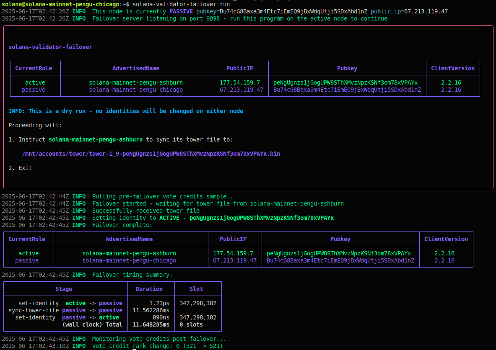

# solana-validator-failover

[](https://opensource.org/licenses/MIT)

Simple p2p Solana validator failovers



A simple QUIC-based program to failover between Solana validators safely and quickly. [This post](https://blog.solstrategies.io/quic-solana-validator-failovers-738d712ac737) explains some background in more detail. In summary this program orchestrates the three-step process of failing over from an active (voting) to a passive (non-voting) validator:

1. active validator sets identity to passive
2. tower file synced from active to passive validator
3. passive validator sets identity to active

Start a failover server on the passive node:


Start a failover client on the active node to hand over to the passive node:


Convenience safety checks, bells, and whistles:

- Check and wait for validator health before failing over
- Wait for the estimated best slot time to failover
- Wait for no leader slots in the near future (if things go sideways - make it hurt a little less by not being leader 😬)
- Post-failover vote credit rank monitoring
- Pre/post failover hooks
- Customizable validator client and set identity commands to support (most) any validator client

## Usage

```shell
# on any node declared in solana-validator-failover.yaml
# run the failover - a passive node will send a request to the active one to take over
# By default it runs in dry-run mode, to run for real, run on the passive node with `--not-a-drill`
solana-validator-failover run
```

By default, `run` runs in dry-run mode where only the tower file is synced between nodes and set identity commands are mocked. This is to safeguard against fat fingers (we've all been there) and also to give an idea of the expected total failover time under current network conditions. When ready, re-run on the passive node with `--not-a-drill` to do it for realsies.

⚠️ WARNING: _who_ you run this program as matters - the user:
- requires permissions to run set identity commands for the validator
- requires permissions to read/write the tower file - check inherited tower file permissions are what you expect after a dry-run

## Installation

Build from source or download the built package for your system from the [releases](https://github.com/SOL-Strategies/solana-validator-failover/releases) page. If your arch isn't listed, ping us.

## Prerequisites

1. A (_preferrably private_ and low-latency) UDP route between active and passive validators. Latency can vary lots across setups, so YMMV, though QUIC should give a good head start.
2. Some focus and appreciation of what you're doing - these can be high pucker factor operations regardless of tooling.

## Configuration

```yaml
# default --config=~/solana-validator-failover/solana-validator-failover.yaml
validator:
  # path of validator program to use when issuing set-identity commands
  # default: agave-validator
  bin: agave-validator

  # (required) cluster this validator runs on
  #            one of: mainnet-beta, testnet, devnet, localnet
  cluster: mainnet-beta

  # this validator's identities
  identities:
    # (required) path to identity file to use when ACTIVE
    active: /home/solana/active-validator-identity.json
    # (required) path to identity file to use when PASSIVE
    passive: /home/solana/passive-validator-identity.json

  # (required) ledger directory made available to set-identity command templates
  ledger_dir: /mnt/ledger

  # local rpc address of node this program runs on
  # default: http://localhost:8899
  rpc_address: http://localhost:8899

  # tower file config
  tower:
    # (required) directory hosting the tower file
    dir: /mnt/accounts/tower

    # when passive, delete the towerfile if one exists before starting a failover server
    # default: false
    auto_empty_when_passive: false

    # golang template to identify the tower file within tower.dir
    # available to the template is an .Identities object
    # default: "tower-1_9-{{ .Identities.Active.PubKey }}.bin"
    file_name_template: "tower-1_9-{{ .Identities.Active.PubKey }}.bin"

  # failover configuration
  failover:

    # failover server config (runs on passive node taking over from active node)
    server:
      # default: 9898 - QUIC (udp) port to listen on
      port: 9898

    # golang template strings for command to set identity to active/passive
    # use this to set the appropriate command/args for your validator as required
    # available to this template will be:
    # {{ .Bin }}        - a resolved absolute path to the binary referenced in validator.bin
    # {{ .Identities }} - an object that has Active/Passive properties referencing
    #                     the loaded identities from validator.identities
    # {{ .LedgerDir }}  - a resolved absolute path to validator.ledger_dir
    # defaults shown below
    set_identity_active_cmd_template:  "{{ .Bin }} --ledger {{ .LedgerDir }} set-identity {{ .Identities.Active.KeyFile }} --require-tower"
    set_identity_passive_cmd_template: "{{ .Bin }} --ledger {{ .LedgerDir }} set-identity {{ .Identities.Passive.KeyFile }}"

    # failover peers - keys are vanity hostnames to help you review program output better
    peers:
      backup-validator-region-x:
        # host and port to connect to failover server
        address: backup-validator-region-x.some-private.zone:9898

    # duration string representing the minimum amount of time before the active node is due to
    # be the leader, if the failover is initiated below this threshold it will wait until this
    # window has passed to begin failing over
    # default: 5m
    min_time_to_leader_slot: 5m

    # post-failover monitoring config
    monitor:
      # monitoring of credit rank pre and post failover
      credit_samples:
        # number of credit samples to take
        # default: 5
        count: 5
        # interval duration between samples
        # default: 5s
        interval: 5s

    # (optional) Hooks to run pre/post failover and when active or passive.
    # They will run sequentially in the order they are declared.
    # The specified command program of a given hook will receive the following runtime env vars
    # it can choose to do what it wants to with (e.g. start/stop ancillary services, send notifications, etc):
    # ------------------------------------------------------------------------------------------------------------
    # SOLANA_VALIDATOR_FAILOVER_IS_DRY_RUN_FAILOVER                     = "true|false"
    # SOLANA_VALIDATOR_FAILOVER_THIS_NODE_ROLE                          = "active|passive"
    # SOLANA_VALIDATOR_FAILOVER_THIS_NODE_NAME                          = hostname of this node
    # SOLANA_VALIDATOR_FAILOVER_THIS_NODE_PUBLIC_IP                     = pubic IP of this node
    # SOLANA_VALIDATOR_FAILOVER_THIS_NODE_ACTIVE_IDENTITY_PUBKEY        = pubkey this node uses when active
    # SOLANA_VALIDATOR_FAILOVER_THIS_NODE_ACTIVE_IDENTITY_KEYPAIR_FILE  = path to keyfile from validator.identities.active
    # SOLANA_VALIDATOR_FAILOVER_THIS_NODE_PASSIVE_IDENTITY_PUBKEY       = pubkey this node uses when active
    # SOLANA_VALIDATOR_FAILOVER_THIS_NODE_PASSIVE_IDENTITY_KEYPAIR_FILE = path to keyfile from validator.identities.active
    # SOLANA_VALIDATOR_FAILOVER_THIS_NODE_CLIENT_VERSION                = gossip-reported solana validator client semantic version for this node
    # SOLANA_VALIDATOR_FAILOVER_PEER_NODE_ROLE                          = "active|passive"
    # SOLANA_VALIDATOR_FAILOVER_PEER_NODE_NAME                          = hostname of peer
    # SOLANA_VALIDATOR_FAILOVER_PEER_NODE_PUBLIC_IP                     = pubic IP of peer
    # SOLANA_VALIDATOR_FAILOVER_PEER_NODE_ACTIVE_IDENTITY_PUBKEY        = pubkey peer uses when active
    # SOLANA_VALIDATOR_FAILOVER_PEER_NODE_PASSIVE_IDENTITY_PUBKEY       = pubkey peer uses when passive
    # SOLANA_VALIDATOR_FAILOVER_PEER_NODE_CLIENT_VERSION                = gossip-reported solana validator client semantic version for peer node
    hooks:
      # hooks to run before failover - errors in pre hooks optionally abort failover
      pre:
        # run before failover when validator is active
        when_active:
          - name: x # vanity name
            command: ./scripts/some_script.sh # command to run
            args: ["arg1", "arg2"]
            must_succeed: true # aborts failover on failure
        # run before failover when validator is passive
        when_passive:
          - name: x # vanity name
            command: ./scripts/some_script.sh # command to run
            args: ["arg1", "arg2"]
            must_succeed: true # aborts failover on failure
      # hooks to run after failover - errors in post hooks displayed but do nothing
      post:
        # run after failover when validator is active
        when_active:
          - name: x # vanity name
            command: ./scripts/some_script.sh # command to run
            args: ["arg1", "arg2"]
        # run after failover when validator is passive
        when_passive:
          - name: x # vanity name
            command: ./scripts/some_script.sh # command to run
            args: ["arg1", "arg2"]
```

## Developing

```shell
# build in docker with live-reload on file changes
make dev
```

## Building

```shell
# build locally
make build

# or build from docker
make build-compose
```

## Laundry/wish list:

- [ ] Support forcing a failover for when active node is properly dead or similar situation
- [ ] Optionally skip tower file syncing (yolo)
- [ ] Set required user to run as and fail
- [ ] Automatic node discovery
- [ ] TLS config
- [ ] Refactor to make e2e testing easier - current setup not optimal
- [ ] Optionally run as long-running service to support (almost) automatic failovers
- [ ] Rollbacks (to the extent it's possible)
- [ ] Log process to a file for those who want/need it for audit trails and such
